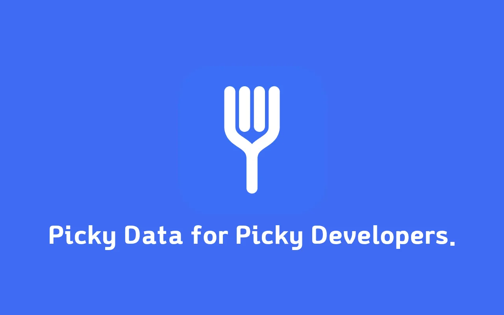

**해당 프로젝트는 Claude Code를 이용해 제작한 과정 입니다.🤖**

## 왜 만들었나

버그를 리포트하거나, 프론트-백엔드 담당자에게 API 문제를 공유하거나, 요즘은 LLM에게 "이 요청 왜 이렇게 응답하는지 봐줘"라고 물어볼 때 매번 똑같은 잡일을 반복하고 있었다.

크롬 DevTools의 Network 패널을 열고, 문제의 요청을 클릭하고, Headers 탭에서 필요한 헤더를 찾아 복사하고, Payload 탭으로 넘어가 요청 본문을 복사하고, Response 탭으로 넘어가 응답 본문을 복사하고, 이걸 다시 보기 좋게 마크다운으로 짜맞추는 과정. DevTools도 "Copy as cURL"이나 "Copy Response" 같은 기능을 제공하지만, 내가 원하는 조합(예: 상태 코드 + 특정 헤더 몇 개 + 본문만)으로는 한번에 나오지 않는다.

<!--truncate-->

결국 필요한 건 "**내가 원하는 포맷을 미리 정의해두면, 요청 하나를 그 포맷 그대로 클립보드에 복사해주는 도구**"였다. 그래서 만든 게 **Picky Data**다. 이름의 "Picky"는 편식쟁이처럼 요청과 응답 값에서 내가 원하는 것만 고른다는 의미를 갖고 있다. 실제로 초기 아이콘 작업 과정에서 이 컨셉을 살려 포크(fork) 모양 아이콘으로 정착시켰다 — 음식을 콕 집어 먹는 도구처럼, 데이터를 콕 집어 복사한다는 은유다.

이 글에서는 이 확장 프로그램이 어떻게 동작하는지, 그리고 만들면서 마주쳤던 몇 가지 흥미로운 기술적 문제들을 정리했다.

## 무엇을 만들었나

Picky Data는 **크롬 DevTools 전용 패널**로 동작하는 확장 프로그램이다. DevTools를 열면 "Picky Data"라는 탭이 하나 더 생기고, 그 안에서:

- 페이지가 발생시키는 네트워크 요청이 실시간으로 목록에 쌓인다 (페이지를 새로고침하면 목록은 자동으로 비워진다)
- 메서드/타입(fetch, doc, css, js, image, font, media, websocket, wasm 등)과 URL 검색어로 목록을 좁힐 수 있다
- 요청을 하나 클릭하면 오른쪽에 **내가 설정해둔 템플릿대로 렌더링된 미리보기**가 뜬다
- 단축키(기본값 `Cmd/Ctrl+Shift+C`)를 누르면 그 내용이 그대로 클립보드에 복사된다
- 옵션 페이지에서 복사 템플릿, 포함할 요청/응답 헤더, 단축키를 자유롭게 바꿀 수 있다

```
manifest.json      크롬 확장 매니페스트 (MV3)
devtools.html/js   DevTools 패널을 등록
panel.html/css/js  DevTools 패널 UI 및 로직
options.html/js    설정 페이지 UI 및 로직
theme.css          라이트/다크 공용 테마 변수
lib/defaults.js    기본 템플릿, 단축키, 스토리지 키
lib/formatter.js   템플릿 토큰 치환 및 헤더 필터 헬퍼
icons/             확장 프로그램 아이콘
```

## 설계 원칙: 빌드 툴 없이, 최소 권한으로

전체 개발 시간을 압박하는 요인은 없었지만, 이번엔 의도적으로 **아무 빌드 도구도 쓰지 않기로** 했다. 번들러도, 트랜스파일러도, 프레임워크도 없다. `panel.html`은 그냥 `<script src="lib/defaults.js">`, `<script src="lib/formatter.js">`, `<script src="panel.js">`를 순서대로 로드하고, 각 스크립트는 모듈 시스템 없이 전역(`PICKY_DATA_DEFAULTS`, `PickyDataFormatter`)으로 값을 노출한다. `chrome://extensions`에서 "압축해제된 확장 프로그램 로드"를 누르면 그대로 동작한다 — 빌드 단계가 없으니 배포 파이프라인도 사실상 zip 압축이 전부다.

대신 타입 안정성은 포기하지 않았다. `jsconfig.json`에서 `checkJs: true`를 켜고, 모든 함수에 JSDoc으로 타입을 달아 TypeScript 컴파일러가 순수 JS 파일을 그대로 검사하게 했다. `devDependencies`는 `typescript`와 `@types/chrome` 딱 둘뿐이고, 용도는 오직 `npx tsc --noEmit`(및 에디터 IntelliSense)이다. 예를 들어 `lib/defaults.js`의 단축키 타입은 이렇게 선언되어 있다.

```js
/**
 * @typedef {Object} Shortcut
 * @property {string} key - 대문자로 저장되는 키 값(예: "C").
 * @property {boolean} ctrlOrCmd - mac은 metaKey(Cmd), win/linux는 ctrlKey.
 * @property {boolean} shift
 * @property {boolean} alt
 */
```

`manifest.json`도 최소한만 선언한다.

```json
{
  "manifest_version": 3,
  "devtools_page": "devtools.html",
  "options_page": "options.html",
  "permissions": ["storage"]
}
```

host permission도, background/service worker도, content script도 없다. 요청받는 권한은 `storage` 하나뿐이고, 모든 설정은 `chrome.storage.local`에만 저장된다. 네트워크 요청 데이터 자체도 DevTools API가 이미 열어준 컨텍스트 안에서만 다뤄지고 외부로 전송되지 않는다 — 개인정보 측면에서 스토어 심사와 사용자 신뢰 양쪽에 유리한 선택이었다.

## 기술 살펴보기

### 1. 토큰 기반 템플릿 엔진

핵심 로직은 `lib/formatter.js`의 `render()` 함수 하나에 다 들어있다. 사용자가 옵션 페이지에서 아래와 같은 템플릿을 정의하면:

```
# {{method}} {{url}}
Status: {{status}} {{statusText}}

## Request Headers
{{requestHeaders}}

## Request Body
{{requestBody}}

## Response Headers
{{responseHeaders}}

## Response Body
{{responseBody}}
```

`render()`는 캡처된 HAR 엔트리에서 `method`, `url`, `host`, `path`, `query`, `status`, `statusText`, `requestHeaders`, `responseHeaders`, `requestBody`, `responseBody` 11개 토큰 값을 만들고, 정규식으로 치환한다.

```js
return template.replace(/{{\s*([a-zA-Z]+)\s*}}/g, (match, key) => {
  return Object.prototype.hasOwnProperty.call(tokens, key)
    ? tokens[key]
    : match;
});
```

여기서 눈여겨볼 부분은 `hasOwnProperty` 가드다. 지원하지 않는 토큰(예: 오타로 `{{metod}}`라고 쓴 경우)을 만나면 빈 문자열로 지워버리는 대신 **원본 문자열을 그대로 남긴다.** 사용자가 자기 템플릿에 실수가 있다는 걸 바로 눈치챌 수 있게 하는, 작지만 의도된 선택이다.

`host`/`path`/`query`는 문자열을 직접 파싱하지 않고 `URL` 생성자에 맡긴다.

```js
function getUrlParts(urlString) {
  try {
    const u = new URL(urlString);
    return {
      host: u.host,
      path: u.pathname,
      query: u.search ? u.search.slice(1) : '',
    };
  } catch (e) {
    return { host: '', path: '', query: '' };
  }
}
```

### 2. JSON 본문은 예쁘게, 아니면 그대로

요청/응답 본문은 JSON일 때도 있고 아닐 때도 있다. `prettifyBody()`는 `JSON.parse` 후 `JSON.stringify(…, null, 2)`로 들여쓰기하되, 파싱에 실패하면 조용히 원본 텍스트를 그대로 돌려준다.

```js
function prettifyBody(text) {
  if (!text) return text;
  try {
    return JSON.stringify(JSON.parse(text), null, 2);
  } catch (e) {
    return text;
  }
}
```

"JSON이면 보기 좋게, 아니면 건드리지 않는다"는 단순한 원칙이지만 실제로 HTML이나 텍스트 응답이 섞여 들어와도 깨지지 않는다.

### 3. 헤더 필터 — 세 가지 표현을 오가는 다리

옵션 페이지에서 헤더 필터는 체크박스 목록(`[{ name, enabled }, ...]`)으로 관리되지만, 저장·전달될 때는 쉼표로 구분된 문자열이 되고, 실제 매칭 시점에는 소문자 배열이 된다. 이 세 표현을 잇는 함수가 `filtersToString()`과 `parseHeaderFilter()`다.

```js
function filtersToString(filters) {
  if (!filters || !filters.length) return '';
  return filters
    .filter((f) => f && f.enabled && f.name && f.name.trim())
    .map((f) => f.name.trim())
    .join(',');
}

function parseHeaderFilter(str) {
  if (!str) return null;
  const names = String(str)
    .split(/[,\n]/)
    .map((s) => s.trim().toLowerCase())
    .filter(Boolean);
  return names.length ? names : null;
}
```

여기서 실제로 버그를 하나 고친 이력이 있다. 처음엔 필터에 걸린 헤더를 **원본 wire 순서**대로 출력했는데, 사용자가 필터 목록에 `content-type, authorization` 순서로 적어놨다면 출력도 그 순서를 따르는 게 더 직관적이다. 그래서 `headersToString()`은 헤더 배열을 순회하는 대신 **필터 배열을 순회하며** 매칭되는 헤더를 찾는 식으로 뒤집었다.

```js
function headersToString(headers, filter) {
  if (!headers || !headers.length) return '';
  if (!filter) return headers.map((h) => `- ${h.name}: ${h.value}`).join('\n');

  // 원본 헤더 순서가 아니라 필터 목록에 적어둔 순서대로 출력한다.
  const lines = [];
  filter.forEach((name) => {
    headers
      .filter((h) => String(h.name).toLowerCase() === name)
      .forEach((h) => lines.push(`- ${h.name}: ${h.value}`));
  });
  return lines.join('\n');
}
```

필터가 비어 있으면(`null`) 전체 헤더를 원본 순서 그대로 포함한다 — "필터를 안 걸었으면 전부 보여준다"는 안전한 기본값이다.

### 4. DevTools는 OS 다크모드를 안 따른다

크롬 DevTools는 **자체 Appearance 설정**(Light/Dark/System)을 갖고 있고, 이건 OS나 브라우저의 `prefers-color-scheme`와 완전히 독립적이다. 즉 OS는 라이트 모드인데 DevTools만 다크로 설정해둔 사용자도 흔하다. `@media (prefers-color-scheme: dark)`만 믿고 만들면 이런 사용자에게는 패널이 계속 라이트로 뜨는 버그가 생긴다.

DevTools 패널(`panel.js`)에서는 확장 프로그램에 노출된 `chrome.devtools.panels.themeName`을 직접 읽어서 반영한다.

```js
// DevTools 자체 테마(Appearance 설정)는 OS/브라우저의 prefers-color-scheme와 별개로
// 사용자가 직접 고를 수 있으므로, chrome.devtools.panels.themeName 을 읽어서 반영한다.
function applyDevtoolsTheme() {
  document.documentElement.dataset.theme =
    chrome.devtools.panels.themeName === 'dark' ? 'dark' : 'light';
}
```

문제는 **옵션 페이지는 DevTools API에 접근할 수 없다**는 점이다(옵션 페이지는 일반 확장 프로그램 페이지지, DevTools 패널이 아니다). 그래서 `theme.css`는 두 가지 해석 전략을 하나의 변수 집합 위에 겹쳐 놓는다.

```css
:root[data-theme='dark'] {
  --bg: #1e1e1e;
  --fg: #e8e8e8; /* … */
}

/* options.html처럼 data-theme을 설정할 수 없는 페이지를 위한 폴백 */
@media (prefers-color-scheme: dark) {
  :root:not([data-theme]) {
    --bg: #1e1e1e;
    --fg: #e8e8e8; /* … */
  }
}
```

패널 페이지는 JS가 `data-theme` 속성을 확실히 심어주니 `:root[data-theme="dark"]` 규칙이 이긴다. 옵션 페이지는 `data-theme`이 아예 없으니 `:not([data-theme])` 폴백이 대신 OS 설정을 따라간다. 같은 색상 변수 세트를, 컨텍스트에 따라 다른 신호로 채우는 셈이다. 이 부분도 처음엔 한 번에 맞지 않아서, 몇 차례 고친 끝에 DevTools 패널이 실제 DevTools 테마를 따르도록 정리했다.

### 5. 미리보기는 지연 로딩 + 캐시, 그리고 stale 응답 방지

응답 본문은 DevTools의 `entry.getContent(callback)`으로 **비동기**로만 가져올 수 있다. 매번 요청마다, 그리고 Copy/Full 미리보기를 토글할 때마다 다시 불러오면 낭비이므로, 한 번 불러온 내용은 `previewContentId`/`previewContent`에 캐시해둔다.

```js
if (previewContentId === id) {
  pre.textContent = PickyDataFormatter.render(
    currentTemplate,
    entry,
    previewContent || '',
    renderOptionsForMode(previewMode),
  );
  return;
}

entry.getContent((content) => {
  if (selectedId !== id) return; // 로딩 중 다른 요청이 선택된 경우 무시
  previewContentId = id;
  previewContent = content || '';
  pre.textContent = PickyDataFormatter.render(
    currentTemplate,
    entry,
    previewContent,
    renderOptionsForMode(previewMode),
  );
});
```

`if (selectedId !== id) return;` 한 줄이 흔한 비동기 레이스 컨디션을 막는다. 사용자가 요청 A를 클릭해 `getContent()` 콜백을 기다리는 동안 요청 B를 클릭해버리면, A의 콜백이 늦게 도착했을 때 이미 선택은 B로 바뀌어 있다. 이 가드가 없으면 B를 보고 있는데 A의 내용으로 미리보기가 덮어써지는 버그가 난다.

### 6. 클립보드 복사: execCommand 우선, Clipboard API는 폴백

```js
function copyToClipboard(text) {
  let copied = false;
  try {
    copyBuffer.value = text;
    copyBuffer.style.display = 'block';
    copyBuffer.focus();
    copyBuffer.select();
    copied = document.execCommand('copy');
    copyBuffer.style.display = 'none';
  } catch (e) {
    copied = false;
  }

  if (copied) {
    showToast('Copied to clipboard.');
    return;
  }

  if (navigator.clipboard && navigator.clipboard.writeText) {
    navigator.clipboard
      .writeText(text)
      .then(() => showToast('Copied to clipboard.'))
      .catch(() => showToast('Copy failed.', true));
  } else {
    showToast('Copy failed.', true);
  }
}
```

보통은 최신 `navigator.clipboard.writeText`를 먼저 쓰고 싶어지지만, DevTools 패널이라는 특수한 컨텍스트(사용자 제스처 처리, 포커스 상태 등)에서는 숨겨진 `<textarea>`에 값을 넣고 `execCommand('copy')`를 쓰는 구식 방식이 오히려 더 안정적으로 동작해서 1순위로 남겨두고, Clipboard API는 실패했을 때의 폴백으로 배치했다.

### 7. 옵션 저장 → 패널 즉시 반영

옵션 페이지에서 템플릿이나 헤더 필터를 저장하면, 패널을 새로고침하지 않아도 바로 반영된다. `chrome.storage.onChanged` 리스너 하나로 처리된다.

```js
chrome.storage.onChanged.addListener((changes, area) => {
  if (area !== 'local') return;
  let shouldRerenderPreview = false;
  if (changes[PICKY_DATA_DEFAULTS.storageKeys.TEMPLATE]) {
    currentTemplate = changes[...].newValue || PICKY_DATA_DEFAULTS.template;
    shouldRerenderPreview = true;
  }
  // ... SHORTCUT, REQUEST_HEADER_FILTER, RESPONSE_HEADER_FILTER 도 동일 패턴
  if (shouldRerenderPreview && selectedId !== null) renderPreview();
});
```

두 페이지가 서로 다른 컨텍스트(DevTools 패널 vs 일반 확장 페이지)로 완전히 분리되어 있는데도, `chrome.storage`라는 공용 저장소 하나를 관찰하는 것만으로 반응형 동기화가 자연스럽게 만들어진다.

## 마무리 작업: 스토어에 올리기까지

기능이 다 돌아간다고 끝이 아니었다. 스토어에 올리려면 몇 가지가 더 필요했다.

**패키징.** `scripts/package.sh`는 제외 목록이 아니라 **포함 목록(화이트리스트)** 방식을 쓴다. `node_modules`, `.git`, README, 개발용 설정 파일 등을 일일이 제외하는 대신, 스토어에 실제로 필요한 파일만 명시적으로 나열한다.

```bash
VERSION=$(node -p "require('./manifest.json').version")
FILES=(
  manifest.json devtools.html devtools.js
  panel.html panel.css panel.js
  options.html options.js theme.css
  lib/defaults.js lib/formatter.js
  icons/icon16.png icons/icon48.png icons/icon128.png
)
zip -X -q "$ZIP_PATH" "${FILES[@]}"
unzip -l "$ZIP_PATH"
```

`icon.svg`나 512px 아이콘처럼 런타임에 필요 없는 파일은 애초에 목록에 없으니 실수로 끼어들 여지가 없고, 마지막 `unzip -l`로 실제 담긴 내용을 눈으로 한 번 더 확인한다. 제외 목록 방식은 새 파일을 추가할 때마다 "이것도 빼야 하나?"를 계속 고민하게 만들지만, 포함 목록은 새 파일이 생겨도 스토어 번들에는 조용히 반영되지 않을 뿐이라 훨씬 마음이 편하다.

**다국어.** README와 스토어 등록 문구는 한국어/영어/일본어/중국어 4개 언어로 준비했다. 다만 런타임 UI 문자열 자체는 오히려 영어로 통일했다 — 다국어는 문서·마케팅 영역이지 UI 번역 시스템을 새로 넣을 정도의 스코프는 아니라고 판단했다. 브랜드명 "Picky Data"는 어느 언어 버전에서도 번역하지 않았다.

## 돌아보며

Claude Code로 기획부터 스토어 등록 준비까지 몇 시간 만에 끝내버릴 줄은 몰랐다. 프롬프트로 기능을 설명하고, `chrome://extensions`에 압축해제 로드해서 바로 눌러보고, 직접 써보면서 초기에는 생각하지 못한 부분들도 추가하면서 완성했다. "바이브 코딩"이라고 해서 그냥 손 놓고 맡겨버린 건 아니었다. 내부 구조와 로직이 궁금해서 커밋을 아토믹하게 나눠 달라고 요청한 뒤, 나중에 커밋 히스토리를 따라가며 개발 내역을 확인했는데 꽤 재밌는 경험이었다.

AI 덕분에 매번 귀찮게 복사했던 일들이 해결됐다. 엄청난 퍼포먼스를 자랑할 정도는 아니지만, 매번 귀찮아하던 나 자신도 편해지고 동료들에게는 보기 좋게 정리된 Request/Response를 전달할 수 있게 됐으니 두 마리 토끼를 다 잡은 셈이다. 일단은 초기 버전으로 만들어뒀지만, 계속 쓰면서 필요한 부분이 보이면 꾸준히 업데이트할 생각이다. 처음엔 그냥 귀찮아서 만들어볼까 정도의 생각이었는데, 일단 AI에게 던져보니 어느새 완성이 돼버렸다. 그래도 기왕 만든 거, 전 세계 어딘가엔 나와 비슷한 귀찮음을 느끼는 사람이 한 명쯤은 있지 않을까 싶어서 $5를 내고 구글 익스텐션 개발자 등록도 했다. 💸

혹시 관심 있는 분들은 한번 사용해보시고 피드백을 주시면 겸손하게 배우는 마음으로 검토하고 업데이트 하겠습니다!

https://chromewebstore.google.com/detail/fhmdmdbneogkofoillfbkidhbcgibacb?utm_source=item-share-cb
