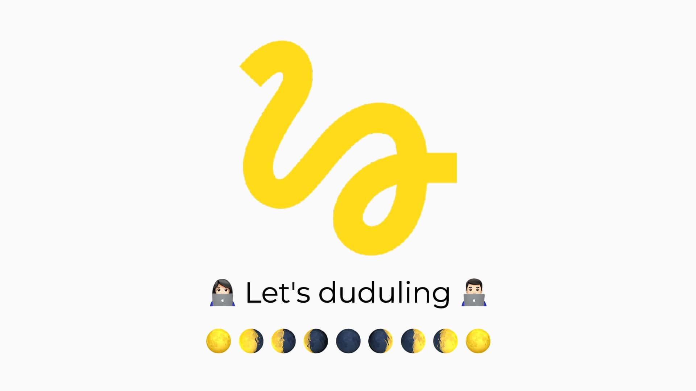

## 벌써 절반이 지나가다니.. 남은 반년 어떻게 보내지?

2020년 상반기가 벌써 끝났다. 하반기 시작한 지도 일주일이 넘었는데 나는 너무 나태한 것 같다. 그래서 나에게 조금 신선한 자극을 주기 위해 스스로 목표를 세워봤다. 목표가 있는 것과 없는 것에 차이가 크다니 한번 시도해보는 것이다. 혹시 잘 안되더라도 손해 보는 것은 없으니 말이다.

#### 우선순위 1위 목표 = 블로거

우선 개인적으로 나도 좋은 개발자가 되어서 작은 지식이라도 공유하고 싶다는 의욕이 컸다. 나도 뭐 나중에 기회가 된다며 많이 참고하는 블로그에 대해서도 작성하겠지만 그분들을 보면서 공부를 시작했기에 나 또한 영향을 받은 것 같다. 그렇기에 첫 번째 포스팅을 블로그를 시작한 나의 후기(?)로 결정했다. 지금 블로그를 고민하거나 시작하려는 사람들에게 도움이 되는 글이 되기를 바란다.

### 블로그 선정하기

- 우선 플랫폼을 제공해주는 방식 (`Tistory`, `Blogger`, `Velog`, `Medium`, `Brunch` 등등)
- 개인이 구축하는 방식 (`Jekyll`, `Hugo`, `Hexo`, `Gatsby`, `Metalsmith` 등등)

자세히 모두 보지는 못했지만, 플랫폼을 이용하는 방식은 제공되는 서비스가 조금씩 다른 것 같았고 개인이 구축하는 방식은 언어의 차이(?)인 것 같은데 나는 개인적으로 React와 GraphQL에 관심이 있었기에 Gatsby를 선택하고 배포는 Netlify를 사용해 보기로 했다.

> `Gatsby` + `GraphQL` + `Netlify`로 결정!! 🎉

### 블로그 첫 포스팅 후기

사실 좀 찾다가 보니 어디의 블로그를 사용하는지에 힘을 쏟는 것보다 일단 하나의 글이라도 작성을 하는 게 좋을 것 같아 일단 제일 마음에 드는 것으로 골랐다. 블로그를 처음 시작하는 지금의 나로서는 사실 당장은 불편함을 못 느끼니 계속 작성하면서 불편함을 느낄 때 나에게 맞는 블로그를 찾아보기로 했다..! (그러니 이 글을 보며 고민하는 분들의 80%는 일단 글을 작성하는 것이 더 나을 수도.. 🤔)

### 앞으로 블로그의 방향 및 목표 🔥

이렇게 템플릿도 찾아서 수정도 조금씩 하면서 일단 시작을 했는데 사실 부족한 게 너무 많은 것 같다. 나의 지식도 많이 부족하고 아직 블로그가 나에게 딱 맞는 구조로 되어 있지도 않은 것 같고 특히 글을 어떻게 작성해야 할지 나의 스타일이 아직 안정해졌다. 처음에는 다른 유명한 블로거분들처럼 짤도 많이 넣고 재밌고 하고 싶었지만 뭔가 다른 사람을 흉내 내는 것 같은 느낌이 들었기에 계속 작성하다 보면 나의 스타일이 생기지 않을까..? 뭐 결론은 많이 작성해봐야 다 해결될 문제 같다.. 😂 그래도 일단 시작한다는 점에 의의를 두고 꾸준히 작성하려 한다. 다른 분들의 말씀에 의하면 너무 힘주고 시작하면 제풀에 지쳐 쓰러지기 십상이니 말이다.

비록 아직 나의 블로그에 맛깔스럽고 흡입력 좋은 필력도 없고 깔끔하면서 예리한 분석과 정리된 내용은 부족하지만, 나의 취지가 **부담을 갖고 공부하고 내가 공부한 지식을 누구에게 조금이라도 나눠줄 수 있다면 좋겠다.** 라는 마음으로 시작했기에 (한 명쯤은 있기를.. 😂) 내가 지속해서 공부하고 그를 바탕으로 짧게라도 그것을 남겨 공유하고 같이 소통하며 성장하는 블로그가 되기를 바랄 뿐이다.

**PS.앞으로 성장하여 더 좋은 글로 많은 사람에게 지식을 공유할 수 있도록 피드백과 응원 부탁드립니다..! 👨🏻‍💻**
