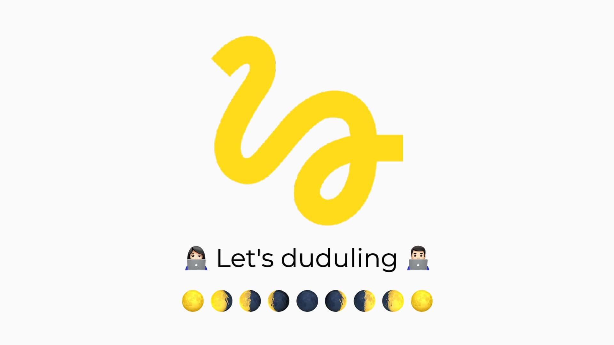

##### 잊지 않기 위해 스스로 보관하기 위한 포스팅으로 편한 말로 적었습니다. 🙇🏻‍♂️

## 블로그에 도전하기!!

4월 5일 식목일을 기념으로 나도 나의 Git에 잔디를 열심히 심어줘야겠다는 다짐으로 올 해 계속 고민하던 블로그를 시작하려 한다. 근데 막상 시작하려 알아봤는데 서비스가 너무 많아 나에게 혼란을 줬다. 그래도 일단 시작한거 일단 생성이라도 해보자..! 😫

그렇게 나의 시작부터 힘든 블로그 여정은 `GitHub-page`, `Tistory`, `Blogger`, `Gatsby.js`, `Velog` 등등 많은 플랫폼 중 뭐가 좋은지 뭐가 나에게 맞는 찰떡 블로그일지 그렇게 몇시간을 삽질하면서 돌아다닌 결과 요즘 사용하는 `React`로 되어 있는 `React` + `GraphQL`의 조합으로 핫한 `Gatsby`를 사용하기로 했고 배포는 `Netlify`로 하기로 결정했다.

> 잘 모르지만 일단 결정했다!!

사실 어디의 블로그를 사용하는지에 힘을 쏟는 것보다 일단 하나의 글이라도 작성을 하는게 좋을 것 같아 일단 제일 마음에 드는 것으로 골랐다. 블로그를 처음 시작하는 지금의 나로써는 어디를 사용하든 그 장점을 100% 유용하게 사용하지는 못할 것이라는 판단에 일단 마무리 ㅎ... 😭

### 나의 목표 🔥

사실 많은 것도 찾아보고 시도해보고 했는데 그 여정의 스토리는 기회가 될 때 다시 올려보도록 하겠다. (아직 저의 필력으로는 차마 정리하기 두렵기에...)

이렇게 템플릿도 찾아서 수정도 조금씩 하면서 일단 시작을 했는데 사실 부족한게 너무 많은 것 같다. 나의 지식도 많이 부족하고 아직 블로그가 나에게 딱 맞는 구조로 되어 있지도 않은 것 같고 어색하지만 일단 시작한다는 점에 의의를 두고 하려 한다. 처음부터 잘하는 사람만 있는 것은 아니니깐...? 하하..

비록 지금 나의 블로에는 깔끔한 정리 예리한 분석 등은 없지만 지금 내가 아는 지식을 누구에게 조금이라도 나눠줄 수 있다면 (한명쯤은 있겠져...? 😂) 내가 지속적으로 공부하고 짧게라도 그것을 남겨 공유하고 같이 소통하며 성장하는 블로그가 되기를 바랄뿐이다..!

그럼 이만! 다음 글로 오겠습니다! 🥺

**주기적으로 블로그를 꼭 작성할 수 있기를!! 👨🏻‍💻**
