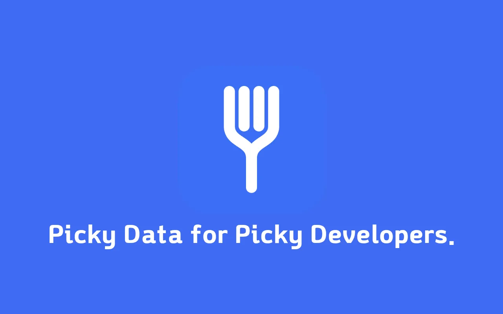

**This project was built using Claude Code.🤖**

## Why I Built This

Whether I was reporting a bug, sharing an API issue with a frontend/backend teammate, or these days asking an LLM to "take a look at why this request responds the way it does," I kept repeating the same tedious chore every time.

Open the Network panel in Chrome DevTools, click the request in question, find and copy the headers I need from the Headers tab, switch to the Payload tab to copy the request body, switch to the Response tab to copy the response body, and then reassemble all of it into readable Markdown. DevTools does offer features like "Copy as cURL" or "Copy Response," but they never give me the exact combination I actually want in one shot (e.g., status code + a few specific headers + body only).

<!--truncate-->

What I really needed was "**a tool that lets me pre-define the exact format I want, then copies a single request to the clipboard in exactly that format**." That's how **Picky Data** came to be. The "Picky" in the name refers to picking out only what I want from a request/response, like a picky eater. In fact, during the early icon design process I leaned into this concept and settled on a fork-shaped icon — a metaphor for picking up data the same way a fork picks up food.

In this post, I'll walk through how this extension works and some of the interesting technical challenges I ran into while building it.

## What I Built

Picky Data is an extension that works as a **dedicated Chrome DevTools panel**. Opening DevTools adds a new tab called "Picky Data," where:

- Network requests fired by the page are appended to the list in real time (the list clears automatically when you refresh the page)
- You can narrow the list by method/type (fetch, doc, css, js, image, font, media, websocket, wasm, etc.) and by URL search text
- Clicking a request shows a **preview rendered according to my configured template** on the right
- Pressing the shortcut (default `Cmd/Ctrl+Shift+C`) copies that content straight to the clipboard
- The copy template, which request/response headers to include, and the shortcut can all be freely changed from the options page

```
manifest.json      Chrome extension manifest (MV3)
devtools.html/js   Registers the DevTools panel
panel.html/css/js  DevTools panel UI and logic
options.html/js    Options page UI and logic
theme.css          Shared light/dark theme variables
lib/defaults.js    Default template, shortcut, storage keys
lib/formatter.js   Template token substitution and header filter helpers
icons/             Extension icons
```

## Design Principle: No Build Tools, Minimal Permissions

There was no real time pressure on the overall development, but I deliberately decided **not to use any build tools** this time. No bundler, no transpiler, no framework. `panel.html` simply loads `<script src="lib/defaults.js">`, `<script src="lib/formatter.js">`, and `<script src="panel.js">` in order, and each script exposes its values as globals (`PICKY_DATA_DEFAULTS`, `PickyDataFormatter`) without any module system. Clicking "Load unpacked" in `chrome://extensions` just works — with no build step, the deployment pipeline is essentially just zipping the files.

That said, I didn't give up on type safety. I turned on `checkJs: true` in `jsconfig.json` and annotated every function with JSDoc types, so the TypeScript compiler could check the plain JS files directly. `devDependencies` has exactly two entries, `typescript` and `@types/chrome`, used solely for `npx tsc --noEmit` (and editor IntelliSense). For example, the shortcut type in `lib/defaults.js` is declared like this:

```js
/**
 * @typedef {Object} Shortcut
 * @property {string} key - The key value, stored uppercase (e.g. "C").
 * @property {boolean} ctrlOrCmd - metaKey (Cmd) on Mac, ctrlKey on Windows/Linux.
 * @property {boolean} shift
 * @property {boolean} alt
 */
```

`manifest.json` also declares only the bare minimum.

```json
{
  "manifest_version": 3,
  "devtools_page": "devtools.html",
  "options_page": "options.html",
  "permissions": ["storage"]
}
```

There's no host permission, no background/service worker, and no content script. The only permission requested is `storage`, and all settings are stored solely in `chrome.storage.local`. The network request data itself is only ever handled within the context DevTools already opens up, and it's never sent anywhere else — a privacy-friendly choice that helped on both the store review and user trust fronts.

## A Closer Look at the Implementation

### 1. Token-Based Template Engine

The core logic all lives in a single `render()` function in `lib/formatter.js`. When a user defines a template like this on the options page:

```
# {{method}} {{url}}
Status: {{status}} {{statusText}}

## Request Headers
{{requestHeaders}}

## Request Body
{{requestBody}}

## Response Headers
{{responseHeaders}}

## Response Body
{{responseBody}}
```

`render()` builds 11 token values — `method`, `url`, `host`, `path`, `query`, `status`, `statusText`, `requestHeaders`, `responseHeaders`, `requestBody`, `responseBody` — from the captured HAR entry, and substitutes them via a regular expression.

```js
return template.replace(/{{\s*([a-zA-Z]+)\s*}}/g, (match, key) => {
  return Object.prototype.hasOwnProperty.call(tokens, key)
    ? tokens[key]
    : match;
});
```

The `hasOwnProperty` guard is the noteworthy part here. When it encounters an unsupported token (say, a typo like `{{metod}}`), instead of wiping it out to an empty string, it **leaves the original string untouched**. It's a small but deliberate choice that lets users immediately notice a mistake in their own template.

`host`/`path`/`query` aren't parsed manually from the string — that's delegated to the `URL` constructor.

```js
function getUrlParts(urlString) {
  try {
    const u = new URL(urlString);
    return {
      host: u.host,
      path: u.pathname,
      query: u.search ? u.search.slice(1) : '',
    };
  } catch (e) {
    return { host: '', path: '', query: '' };
  }
}
```

### 2. Pretty-Print JSON Bodies, Leave Everything Else As-Is

Request/response bodies are sometimes JSON and sometimes not. `prettifyBody()` indents them via `JSON.parse` followed by `JSON.stringify(…, null, 2)`, but if parsing fails, it silently returns the original text unchanged.

```js
function prettifyBody(text) {
  if (!text) return text;
  try {
    return JSON.stringify(JSON.parse(text), null, 2);
  } catch (e) {
    return text;
  }
}
```

It's a simple rule — "pretty-print if it's JSON, leave it alone otherwise" — but in practice it doesn't break even when HTML or plain-text responses show up mixed in.

### 3. Header Filters — A Bridge Between Three Representations

On the options page, header filters are managed as a checkbox list (`[{ name, enabled }, ...]`), but when saved and passed around they become a comma-separated string, and at actual matching time they become a lowercase array. The functions bridging these three representations are `filtersToString()` and `parseHeaderFilter()`.

```js
function filtersToString(filters) {
  if (!filters || !filters.length) return '';
  return filters
    .filter((f) => f && f.enabled && f.name && f.name.trim())
    .map((f) => f.name.trim())
    .join(',');
}

function parseHeaderFilter(str) {
  if (!str) return null;
  const names = String(str)
    .split(/[,\n]/)
    .map((s) => s.trim().toLowerCase())
    .filter(Boolean);
  return names.length ? names : null;
}
```

There's an actual bug fix behind this. Initially, filtered headers were printed in their **original wire order**, but if a user wrote their filter list as `content-type, authorization`, it's more intuitive for the output to follow that same order. So `headersToString()` was flipped to **iterate over the filter array** and look up matching headers, instead of iterating over the header array.

```js
function headersToString(headers, filter) {
  if (!headers || !headers.length) return '';
  if (!filter) return headers.map((h) => `- ${h.name}: ${h.value}`).join('\n');

  // Output follows the order written in the filter list, not the original header order.
  const lines = [];
  filter.forEach((name) => {
    headers
      .filter((h) => String(h.name).toLowerCase() === name)
      .forEach((h) => lines.push(`- ${h.name}: ${h.value}`));
  });
  return lines.join('\n');
}
```

When the filter is empty (`null`), all headers are included in their original order — a safe default of "show everything if no filter was set."

### 4. DevTools Doesn't Follow the OS Dark Mode

Chrome DevTools has its **own Appearance setting** (Light/Dark/System) that is completely independent of the OS or browser's `prefers-color-scheme`. In other words, it's common for a user to have the OS in light mode while DevTools itself is set to dark. If you build relying solely on `@media (prefers-color-scheme: dark)`, this kind of user ends up with a panel that's stuck showing light mode — a bug.

In the DevTools panel (`panel.js`), I read `chrome.devtools.panels.themeName`, which the extension has access to, directly and apply it.

```js
// DevTools' own theme (Appearance setting) is independent of the OS/browser prefers-color-scheme
// and can be chosen directly by the user, so we read chrome.devtools.panels.themeName and apply it.
function applyDevtoolsTheme() {
  document.documentElement.dataset.theme =
    chrome.devtools.panels.themeName === 'dark' ? 'dark' : 'light';
}
```

The problem is that **the options page has no access to the DevTools API** (the options page is a regular extension page, not a DevTools panel). So `theme.css` layers two different resolution strategies on top of a single set of variables.

```css
:root[data-theme='dark'] {
  --bg: #1e1e1e;
  --fg: #e8e8e8; /* … */
}

/* Fallback for pages like options.html that can't set data-theme */
@media (prefers-color-scheme: dark) {
  :root:not([data-theme]) {
    --bg: #1e1e1e;
    --fg: #e8e8e8; /* … */
  }
}
```

On the panel page, JS reliably sets the `data-theme` attribute, so the `:root[data-theme="dark"]` rule wins. The options page never has `data-theme` at all, so the `:not([data-theme])` fallback follows the OS setting instead. It's the same set of color variables, filled in by a different signal depending on context. This part didn't work perfectly the first time either — it took a few rounds of fixes before the DevTools panel reliably followed the actual DevTools theme.

### 5. Lazy-Loaded, Cached Previews — and Guarding Against Stale Responses

Response bodies can only be fetched **asynchronously**, via DevTools' `entry.getContent(callback)`. Re-fetching it every time a request is selected, or every time the Copy/Full preview is toggled, would be wasteful, so content that's already been fetched once is cached in `previewContentId`/`previewContent`.

```js
if (previewContentId === id) {
  pre.textContent = PickyDataFormatter.render(
    currentTemplate,
    entry,
    previewContent || '',
    renderOptionsForMode(previewMode),
  );
  return;
}

entry.getContent((content) => {
  if (selectedId !== id) return; // Ignore if a different request was selected while loading
  previewContentId = id;
  previewContent = content || '';
  pre.textContent = PickyDataFormatter.render(
    currentTemplate,
    entry,
    previewContent,
    renderOptionsForMode(previewMode),
  );
});
```

The single line `if (selectedId !== id) return;` guards against a common async race condition. If a user clicks request A and, while waiting for the `getContent()` callback, clicks request B, then by the time A's callback finally arrives the selection has already changed to B. Without this guard, you'd end up with a bug where you're looking at B but the preview gets overwritten with A's content.

### 6. Copying to Clipboard: execCommand First, Clipboard API as Fallback

```js
function copyToClipboard(text) {
  let copied = false;
  try {
    copyBuffer.value = text;
    copyBuffer.style.display = 'block';
    copyBuffer.focus();
    copyBuffer.select();
    copied = document.execCommand('copy');
    copyBuffer.style.display = 'none';
  } catch (e) {
    copied = false;
  }

  if (copied) {
    showToast('Copied to clipboard.');
    return;
  }

  if (navigator.clipboard && navigator.clipboard.writeText) {
    navigator.clipboard
      .writeText(text)
      .then(() => showToast('Copied to clipboard.'))
      .catch(() => showToast('Copy failed.', true));
  } else {
    showToast('Copy failed.', true);
  }
}
```

It's tempting to reach for the modern `navigator.clipboard.writeText` first, but in the special context of a DevTools panel (user-gesture handling, focus state, etc.), the older approach of setting a value on a hidden `<textarea>` and calling `execCommand('copy')` turned out to work more reliably, so I kept it as the primary method and placed the Clipboard API as the fallback for when it fails.

### 7. Saving Options → Instant Reflection in the Panel

When a template or header filter is saved on the options page, it's reflected immediately without having to refresh the panel. This is all handled by a single `chrome.storage.onChanged` listener.

```js
chrome.storage.onChanged.addListener((changes, area) => {
  if (area !== 'local') return;
  let shouldRerenderPreview = false;
  if (changes[PICKY_DATA_DEFAULTS.storageKeys.TEMPLATE]) {
    currentTemplate = changes[...].newValue || PICKY_DATA_DEFAULTS.template;
    shouldRerenderPreview = true;
  }
  // ... SHORTCUT, REQUEST_HEADER_FILTER, RESPONSE_HEADER_FILTER follow the same pattern
  if (shouldRerenderPreview && selectedId !== null) renderPreview();
});
```

Even though the two pages are completely separate contexts (DevTools panel vs. a regular extension page), simply watching the shared `chrome.storage` store is enough to get reactive synchronization for free.

## Final Steps: Getting It Onto the Store

Having the feature fully working wasn't the end of it. Getting it onto the store required a few more things.

**Packaging.** `scripts/package.sh` uses an **allowlist** rather than an exclude list. Instead of individually excluding `node_modules`, `.git`, the README, dev-only config files, etc., it explicitly lists only the files actually needed for the store.

```bash
VERSION=$(node -p "require('./manifest.json').version")
FILES=(
  manifest.json devtools.html devtools.js
  panel.html panel.css panel.js
  options.html options.js theme.css
  lib/defaults.js lib/formatter.js
  icons/icon16.png icons/icon48.png icons/icon128.png
)
zip -X -q "$ZIP_PATH" "${FILES[@]}"
unzip -l "$ZIP_PATH"
```

Files not needed at runtime, like `icon.svg` or the 512px icon, simply aren't in the list to begin with, so there's no room for them to sneak in by accident, and the final `unzip -l` gives one more visual check of what's actually included. An exclude list forces you to keep asking "should this be excluded too?" every time you add a new file, but with an allowlist, any new file just silently doesn't make it into the store bundle — much more peace of mind.

**Localization.** The README and store listing copy were prepared in four languages: Korean, English, Japanese, and Chinese. The runtime UI strings themselves, however, were kept in English across the board — I judged that localization belonged in the documentation/marketing space here, not something that warranted building a whole new UI translation system. The brand name "Picky Data" wasn't translated in any language version.

## Looking Back

I didn't expect to go from planning to store-submission-ready in just a few hours with Claude Code. I described features in prompts, loaded the unpacked extension into `chrome://extensions` to try it right away, and finished it up by adding things I hadn't originally thought of as I actually used it. Calling it "vibe coding" doesn't mean I just handed everything off and walked away, though. Curious about the internal structure and logic, I asked for commits to be split atomically, and later followed the commit history to review how the development unfolded — it was a genuinely fun experience.

Thanks to AI, the tedious copying I used to do every time is solved. It's not exactly a performance showcase, but it's made my own life easier while letting me hand teammates a nicely formatted Request/Response — so I got both birds with one stone. It's just a first version for now, but I plan to keep updating it as I use it and notice what's missing. It started as a "might as well build this since it's annoying" kind of thought, and before I knew it, throwing it at an AI turned it into something finished. Since I'd already built it, I figured there might be at least one person out there in the world who feels the same kind of annoyance I do, so I paid the $5 registration fee and signed up as a Google extension developer too. 💸

If you're interested, please give it a try — I'd love to hear your feedback, and I'll review and update it with an open mind.

https://chromewebstore.google.com/detail/fhmdmdbneogkofoillfbkidhbcgibacb?utm_source=item-share-cb
